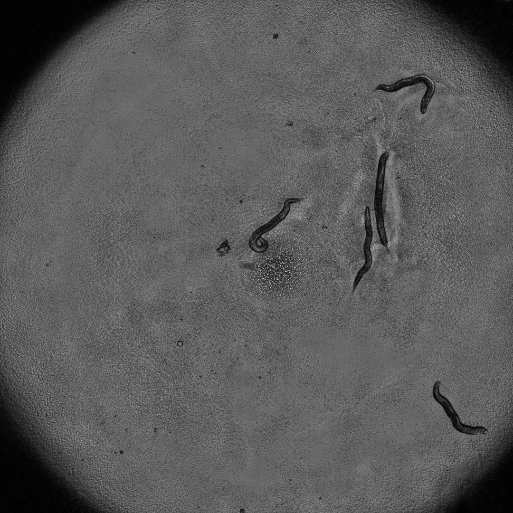
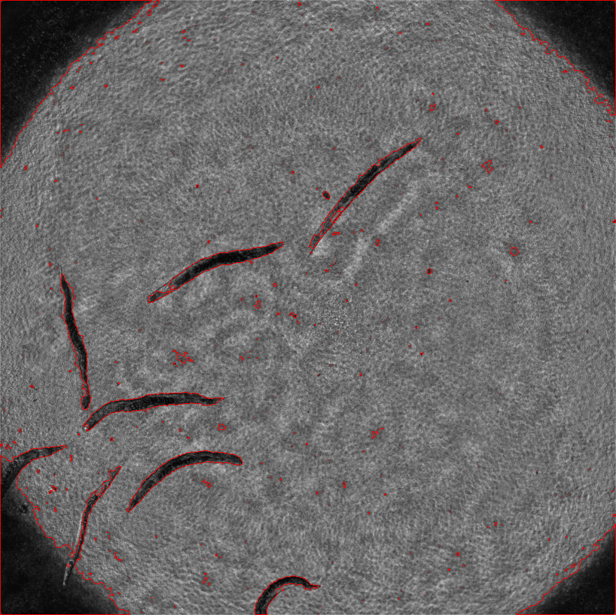

# level set method for image segmentation by python
## 过程  
这是一个水平集方法的图像分割的算法  
最近一直忙于图像分割  
对于我这个新手来说很伤真的是各种google  
不过还好收获很大  
在网上找了很多但是也没有找到python 的code  
所以自己参考他人的c++代码写了一份python的  
这是大佬的[c++代码](https://blog.csdn.net/a553654745/article/details/45500803) 写的非常优美  
## 这是图像的前后对比  
* 处理前

* 处理后

