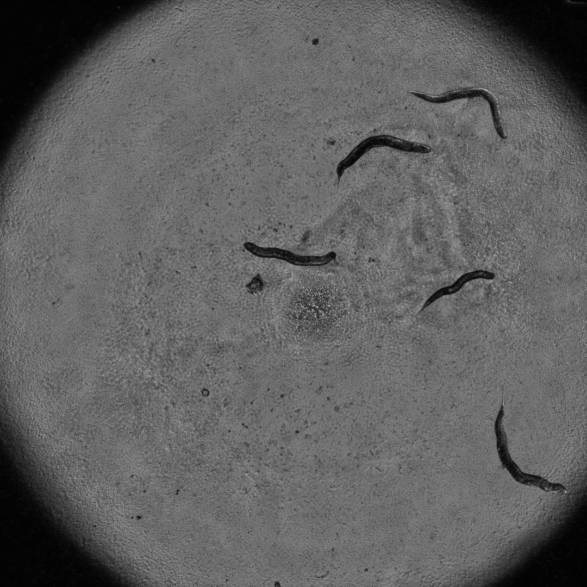
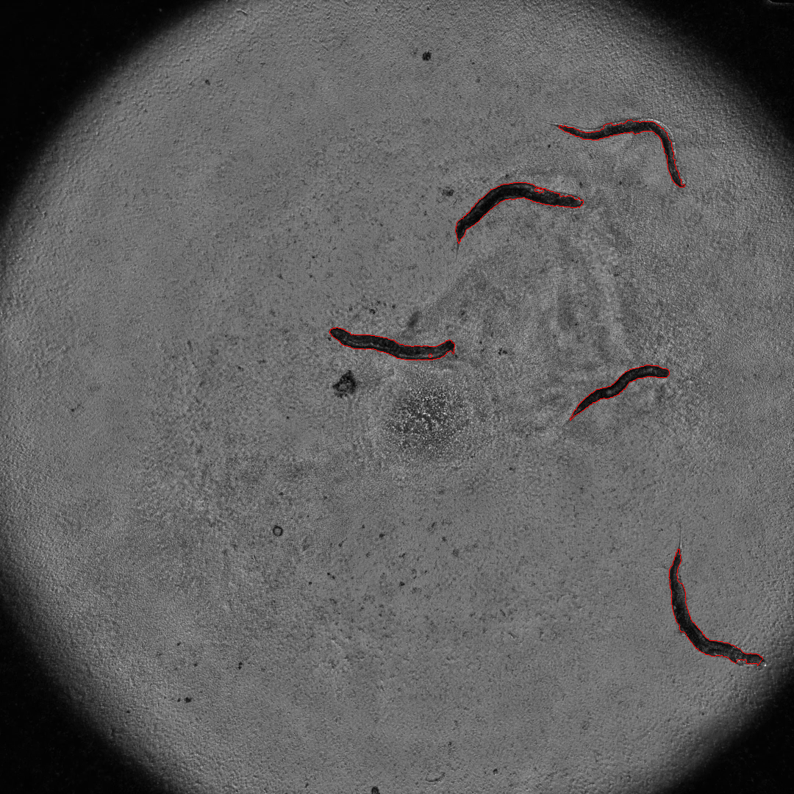

# level set method for image segmentation by python
## 水平集算法
水平集算法大致可以理解为，给定一条闭合曲线和曲线前进方向，那么根据当前位置的移动方向上的梯度来改变移动速度，直到结束。

在实际应用中，水平集方法也是有缺陷的，对于图像明显且没有噪声时是很棒的，对于本项目中的图像，
需要一些形态学方法来处理噪声，包括腐蚀膨胀等,并且不同的图像可能不一样。

### 版本

###### pycharm 

python 3.7

opencv-python 3.4.3.18

numpy 1.15.4

matplotlib 3.0.2

## 这是图像的前后对比
* 处理前

* 处理后

## [参考](https://blog.csdn.net/a553654745/article/details/45500803)